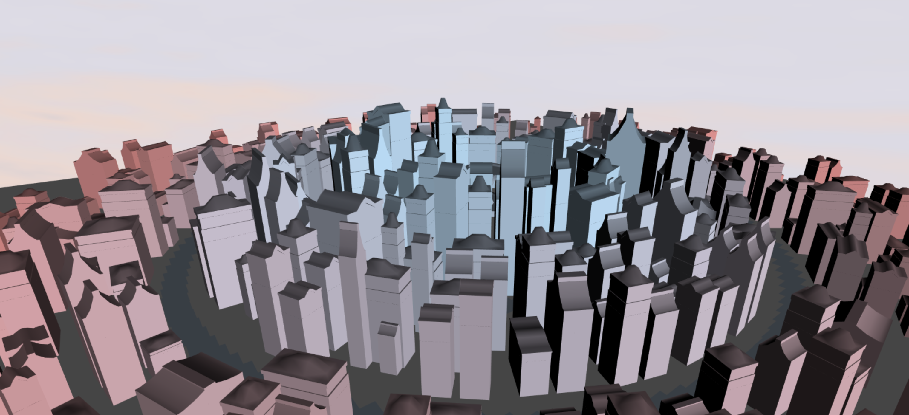
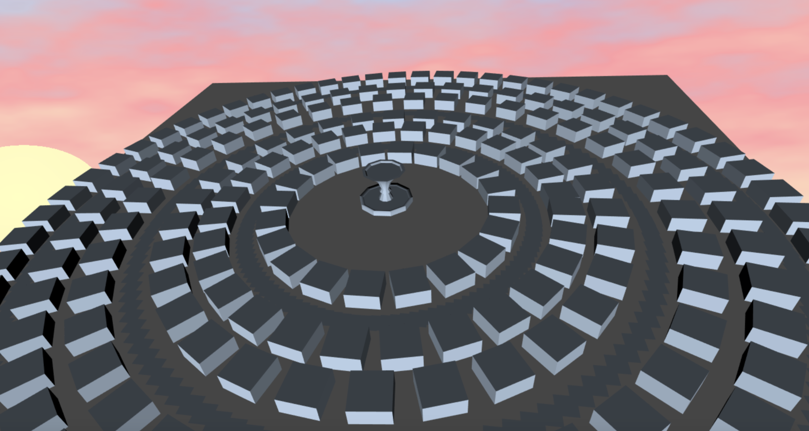

# Kathryn Miller

## Link: 
https://kathrynmiller.github.io/homework-5-shape-grammar-city-KathrynMiller/index.html

## Grammar Class

* I created a grammar class which contained methods for parsing the initial blocks into more detailed buildings and shapes

* Each initial block can subdivide into one of five configurations, each of which has its axes randomly assigned so that the same configurations don't all face in the same direction

* Once the initial block has been subdivided, the newer buildings can be scaled in the y direction. This is based on the building's proximity to the center of the city such that those closer to the center are taller and the building heights fall off towards the edge of the city. The heights also have variation applied to them such that buidings equidistant from the center also have variation.

* If the current building being parsed is terminal (it has been sufficiently divided in x and z and has reached its maximum height given its location), if the parent does not yet have a roof, one of three random roofs is appended to the parent. Otherwise the building is finished.

# City Renderer

* The city renderer class keeps track of all the geometry in the scene and has a grammar instance in order to parse the buildings

* I knew I wanted a city with a concentric layout so I created a function that would place a base cube at a given radius and angle relative to the center of the city then rotates it to face the center

Initial layout
 

* After the roads and buildings are laid out, the parseShapeGrammar function is called which invokes the grammar's divide function on each building and finishes the city

# Color

I assigned each geometry a color as a linear interpolation of two colors based on the building's distance from the center of the city. I also encapsulated the entire city in an Icosphere that I applied a different shader to in order to create a skybox

